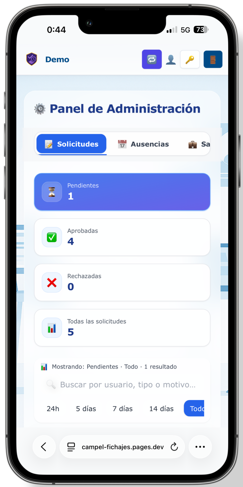
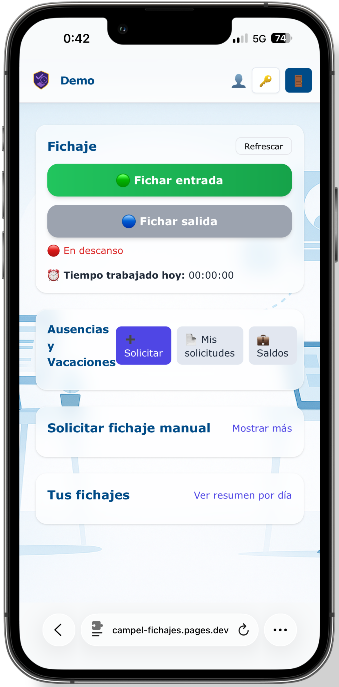

# SaaS de Fichajes para PYMEs

Plataforma de control horario en producción, con clientes de pago activos y desarrollada para digitalizar el registro laboral de pequeñas y medianas empresas.

Pensada para organizaciones que necesitan cumplir con la normativa sin depender de Excel, papel o software heredado.

  

> El código fuente de este producto se mantiene privado por motivos de seguridad y explotación comercial.  
> Este repositorio actúa como showcase técnico del proyecto: arquitectura, decisiones técnicas y capturas reales del sistema.

 

🌐 **Portfolio:** [Proyecto Fichajes](https://portfolio-adrisanchez.vercel.app/proyecto/fichajes)  
📧 **Contacto / Demo:** adri.ia.dev@gmail.com

---

# El problema

Toda empresa en España está obligada a registrar la jornada laboral de sus empleados.

La mayoría de PYMEs siguen resolviéndolo mediante:
- hojas de cálculo
- documentos manuales
- software antiguo
- procesos poco preparados para auditorías

Esto genera errores, pérdida de tiempo y dificultades cuando llega una inspección laboral.

---

# La solución

Un SaaS moderno orientado a reducir fricción tanto para empresa como para empleado.

### El trabajador
- Ficha desde móvil u ordenador
- No necesita instalar aplicaciones
- Tiene acceso simple y rápido a sus registros

### El responsable
- Gestiona usuarios, ausencias y horarios desde un panel centralizado
- Exporta informes legales en segundos
- Mantiene trazabilidad completa de cambios y acciones

---

# Funcionalidades principales

- Fichaje responsive (móvil y escritorio)
- Panel de administración multiempresa
- Gestión de usuarios, horarios y ausencias
- Exportaciones legales en CSV, PDF y XLSX
- Roles y permisos diferenciados
- Trazabilidad y auditoría de cambios
- Arquitectura preparada para escalado SaaS

---

# Capturas del producto

## Panel principal

  

---

## Vista móvil

  

---

## Gestión y administración

  

---

# Stack tecnológico

| Capa | Tecnología |
|---|---|
| Frontend | Next.js · TypeScript · Tailwind · shadcn/ui |
| Backend | FastAPI (Python) |
| Base de datos | PostgreSQL · Neon · Prisma |
| Infraestructura | Docker · Vercel · Cloud Run |
| Autenticación | JWT con roles |
| Exportaciones | PDF · XLSX · CSV |

---

# Decisiones técnicas

### FastAPI en lugar de Node.js

Uso de tipado estricto mediante Pydantic y mejor rendimiento procesando exportaciones pesadas y operaciones concurrentes.

---

### Arquitectura multiempresa desde el inicio

Separación lógica y permisos diseñados para soportar múltiples organizaciones sin rehacer el modelo de datos más adelante.

---

### Exportaciones como funcionalidad principal

La generación de informes preparados para inspección laboral es una de las funcionalidades más críticas del producto.

El objetivo no es solo fichar, sino facilitar auditorías y reducir carga administrativa.

---

### shadcn/ui frente a librerías cerradas

Control completo sobre los componentes visuales y consistencia de diseño en todo el panel.

---

### Neon y entornos de staging

Uso de branching en base de datos para pruebas y despliegues controlados sin replicaciones manuales complejas.

---

# Estado actual

- Producto en producción
- Clientes reales activos
- Desarrollo continuo de nuevas funcionalidades
- Mantenimiento y soporte activo

---

# Contacto

¿Buscas una demo, colaboración o información sobre el proyecto?

📧 **adri.ia.dev@gmail.com**  
🌐 **Portfolio:** https://portfolio-adrisanchez.vercel.app  
💼 **LinkedIn:** https://www.linkedin.com/in/adrian-sanchez-guerrero
